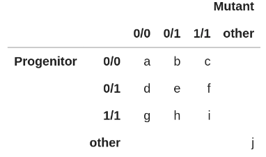
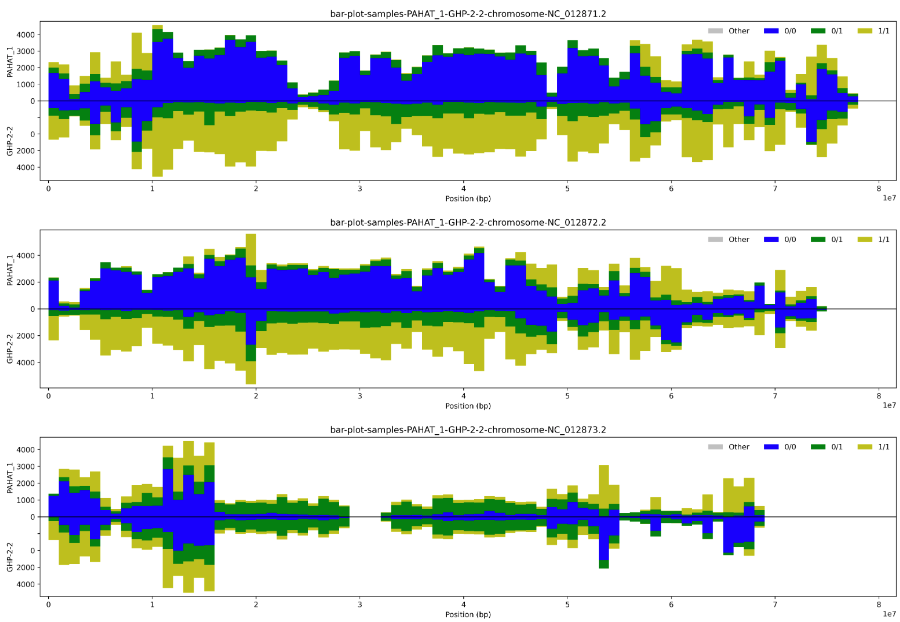
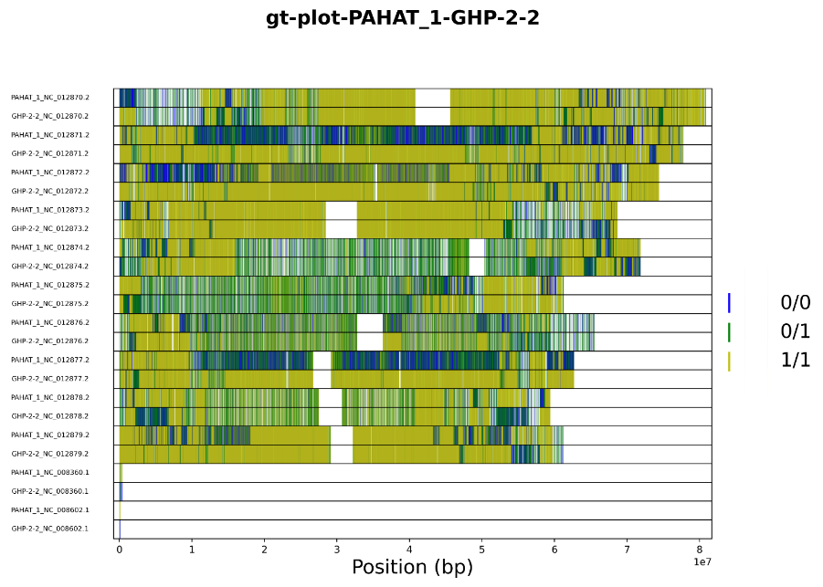
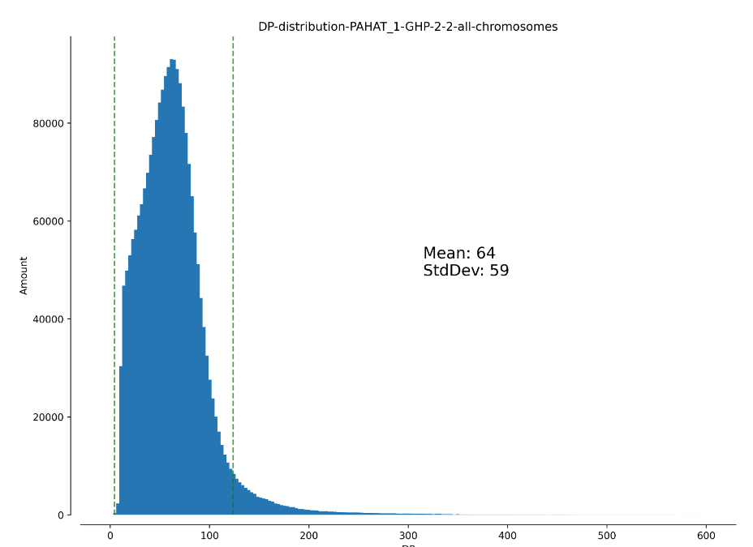
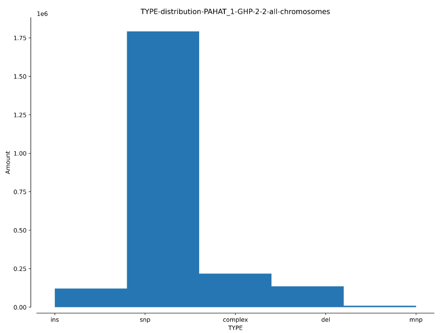

.. gdd documentation master file, created by
   sphinx-quickstart on Tue Feb  2 11:10:57 2021.
   You can adapt this file completely to your liking, but it should at least
   contain the root `toctree` directive.

GDD - Genomic Diversity Distribution
====================================

Introduction
------------

GDD is a tool for variant analysis written in Python. It uses multiple libraries, such as Pandas, Numpy, Scikit-Allel, and others. The description and parameters for each function is described below. The online step-by-step documentation can also be found `online in the ReadtheDocs webpage <https://gdd.readthedocs.io/en/latest/>`_ or by copy/pasting the following link: https://gdd.readthedocs.io/en/latest/.

Available Functions
-------------------

attribute_guide
^^^^^^^^^^^^^^^

**Usage**:

::

   attribute_guide(attribute_dictionary)

**Description**:

Prints out attribute name, attribute description, and value type of the available attributes from the INFO and FORMAT fields of a VCF file. The parameter is the following:

1. ``attribute_dictionary`` - dictionary extracted from the VCF file after using ``vcf_to_table()`` function.

ct_bar_plots
^^^^^^^^^^^^

**Usage**:

::

   ct_bar_plots(samples, vcf_dataframe, chrom_len_dataframe, window_size)

**Description**:

Plots a genotypic contingency histogram of two samples, depicting by color genotypes along each chromosome. It is essential to use the contingency table guide printed from the output of the ``ct_guide()`` function. The parameters consist of:

1. ``samples`` - list of the two samples being compared.
2. ``vcf_dataframe`` - pandas dataframe containing the ``GT_sampleA`` and ``GT_sampleB`` fields.
3. ``chrom_len_dataframe`` - pandas dataframe containing the chromosome names and their respective lengths.
4. ``window_size`` - the length in base-pairs (bp) of the window size to be analyzed.

Below is an example of the output.

.. figure:: docs/images/ctbarplot.png
   :alt: ct-bar-plot
   :width: 600
   :align: center

   contingency bar genotypes plots for samples 'PAHAT_1' and 'GHP-2-2' for 3 chromosomes (click to expand)

ct_guide
^^^^^^^^

**Usage**: 

:: 

   ct_guide()

**Description**:

Prints out a table, showing letters that serve as a guide for the contingency table bar plots output from the ``ct_bar_plots()`` function described above. The table can be seen below.

   contingency table guide for the CTbarPlots function

ct_table
^^^^^^^^

**Usage**:

::

   ct_table(samples, vcf_dataframe, chromosome_name)

**Description**:

Returns a contingency table of two samples in table form. The parameters are the following:

1. ``samples`` - list of two samples.
2. ``vcf_dataframe`` - pandas dataframe containing the genotypes GT of the ``samples`` extracted from the VCF file; the dataframe can also be mutated after filtering being done.
3. ``chromosome_name`` - a string used to save the name of the chromosome being compared; to print the contingency table of a specific chromosome, the ``vcf_dataframe`` first needs to be filtered for the specific chromosome; if printing contingency table of all chromosomes, type ``all``. Here is an example:

::

   
   chromosome_filter = 'CHROM == Chr12'
   chromosome_dataframe = extract_df_data(vcf_dataframe, chromosome_filter)
   ct_table(samples, chromosome_dataframe, chromosome)

The output of all chromosomes would look like the following:

``Contingency Table - Chromosome Chr12``

+--------------+-----------------------------------------------+
|              |                SampleB                        |
+--------------+---------+---------+---------+---------+-------+
|              |         |  0/0    |   0/1   |   1/1   | other |
|              +---------+---------+---------+---------+-------+
|              |   0/0   |   #     |    #    |    #    |       |
|              +---------+---------+---------+---------+-------+
|   SampleA    |   0/1   |   #     |    #    |    #    |       |
|              +---------+---------+---------+---------+-------+
|              |   1/1   |   #     |    #    |    #    |       |
|              +---------+---------+---------+---------+-------+
|              |  other  |         |         |         |   #   |
+--------------+---------+---------+---------+---------+-------+

Here is an actual output. Notice how all the numbers inside ``other`` are the same, meaning that these numbers represent the total number of genotypes that are not 0/0, 0/1, or 1/1.

.. figure:: docs/images/cttable.png
   :alt: ct-table
   :align: center

   contingency table of genotypes for samples 'PAHAT_1' and 'GHP-2-2' for all chromosomes

extract_attributes
^^^^^^^^^^^^^^^^^^

**Usage**:

::

   attributes = extract_attributes(vcf_file)

**Description**:

Returns a dictionary of the available attributes/fields in the VCF file. The available attributes will be printed, giving the user the option to input wanted attributes besides the mandatory ones (specified in this printed output) in the function ``vcf_to_table()`` function.The parameter option is:

1. ``vcf_file`` - path/name to VCF file. 

The output is:

1. ``attributes`` - dictionary containing the available attributes/fields in the VCF file.

extract_df_data
^^^^^^^^^^^^^^^

**Usage**:

::

   filtered_vcf_dataframe = filter_vcf(vcf_dataframe, filter_list)

**Description**:

Returns a filtered vcf_dataframe. A filter list can be input in the ``filter_list`` parameter. The parameter options are:

1. ``vcf_dataframe`` - pandas dataframe containing all the samples' attributes to be analyzed.
2. ``filter_list`` - string containing comparison operators, while each comparison is separated by commas; as an example, if only SNPs variants are to be kept, while also clipping depth/coverage, chromosome, specific genotype, and quality, here is how it is done:

::

   filter_list = "TYPE == snp, DP >= 10, DP <= 100, CHROM != mitochondria, GT_mutant == 1/1, QUAL > 1000"
   filtered_vcf_dataframe = extract_df_data(vcf_dataframe, filter_list)

filter_sim_gt
^^^^^^^^^^^^^

**Usage**:

::

   filtered_vcf_dataframe = filter_sim_gt(samples, vcf_dataframe, genotype_list)

**Description**:

Returns a dataframe that has filtered out variants where two samples have the same genotype, i.e. not real variants. The parameters consist of:

1. ``samples`` - list of 2 samples being analyzed.
2. ``vcf_dataframe`` - pandas dataframe containing the ``GT_sampleName`` field per sample.
3. ``genotype_list`` - list of genotypes to be filtered out; normally, loci where both samples have 0/0, 1/1, or other genotypes that are not 0's or 1's are filtered out; these other genotypes could be 0/2, 1/3, 1/2, etc.

Example:

::

   genotypes = ['0/0', '1/1']
   filtered_vcf_dataframe = filter_sim_gt(samples, vcf_dataframe, genotypes)
   ct_table(samples, filtered_vcf_dataframe, 'all')

gt_bar_plots
^^^^^^^^^^^^

**Usage**:

::

   gt_bar_plots(samples, vcf_dataframe, chrom_len_dataframe, window_size)

**Description**:

Plots genotypic histograms of two samples, depicting by color 0/0, 0/1, or 1/1 genotypes along each chromosome per sample. The parameters consist of:

1. ``samples`` - list of the two samples being compared.
2. ``vcf_dataframe`` - pandas dataframe containing the ``GT_sampleA`` and ``GT_sampleB`` fields.
3. ``chrom_len_dataframe`` - pandas dataframe containing the chromosome names and their respective lengths.
4. ``window_size`` - the length in base-pairs (bp) of the window size to be analyzed.

Below an example figure can be seen.

   genotype bar plots for samples 'PAHAT_1' and 'GHP-2-2' for 3 chromosomes (click to expand)

gt_plot
^^^^^^^

**Usage**:

::
   
   gt_plot(samples, vcf_dataframe, chrom_len_dataframe, linethickness=0.02)

**Description**:

Plots the 0/0, 0/1, 1/1 genotypes of each chromosome per sample in one figure. The parameters are:

1. ``samples`` - list of samples to focus on from VCF file.
2. ``vcf_dataframe`` - pandas dataframe containing the ``sampleName_GT`` field per sample.
3. ``chrom_len_dataframe`` - pandas dataframe containing the chromosome names and their respective lengths.
4. ``linethickness`` - default to 0.02; useful to control line thickness when only a few genotypes are present in the dataframe. 

Below an example figure can be seen.

   genotype plots for samples 'PAHAT_1' and 'GHP-2-2' for all chromosomes (click to expand)

gt_plots
^^^^^^^^

**Usage**:

::

   gt_plots(samples, vcf_dataframe, chrom_len_dataframe, linethickness=0.02)

**Description**:

Plots the 0/0, 0/1, and 1/1 genotypes per chromosome per sample. The parameters are:

1. ``samples`` - list samples being analyzed.
2. ``vcf_dataframe`` - pandas dataframe containing the ``sampleName_GT`` field per sample.
3. ``chrom_len_dataframe`` - pandas dataframe containing the chromosome names and their respective lengths.
4. ``linethickness`` - default to 0.02; useful to control line thickness when only a few genotypes are present in the dataframe.

Below an example figure can be seen.

.. figure:: docs/images/gtplots.png
   :alt: gt-plots
   :width: 600
   :align: center

   genotype plots for samples 'PAHAT_1' and 'GHP-2-2' for 3 chromosomes (click to expand)

variant_hist
^^^^^^^^^^^^

**Usage**:

::

   variant_hist(samples, vcf_dataframe, chromosome, attribute, bins=50, MSTD=False, xmin=0, xmax=0)

**Description**:

Plots histogram of specified ``attribute`` from the ``vcf_dataframe``. The parameters are:

1. ``samples`` - list of samples; used to create title of plot and to save the plot with the samples being analyzed; does not affect the output of the histogram.
2. ``vcf_dataframe`` - pandas dataframe containing all the samples' attributes to be analyzed.
3. ``chromosome`` - chromosome being analyzed; if analyzing variants from all chromosomes, inserte ``all`` as the parameter; used to create title and save the plot; does not affect the output of histogram.
4. ``attribute`` - attribute being analyzed; options are: ``CHROM``, ``POS``, ``REF``, ``ALT``, ``QUAL``, ``DP``, ``sampleName_GT``, ``sampleName_AD``, ``sampleName_AN``, ``TYPE``.
5. ``bins`` - number of bins for the histogram grouping.
6. ``MSTD`` - default to ``False``; if ``True``, the histogram will include the Mean and STandard Deviation (MSTD) values, while showing vertical lines of the first ± standard deviation.
7. ``xmin`` - default to 0; if edited, will not work unless used in combination with the ``xmax`` parameter.
8. ``xmax`` - default to 0, which in reality plots all the way to the maximum X value of the attribute; when bigger than 0, the x-axis will be limited to the number inserted.

Below multiple example figures for ``DP``, ``TYPE`` and ``PAHAT_1_GT`` can be seen.

   ``DP`` histogram for 'PAHAT_1' for all chromosomes (click to expand)

   ``TYPE`` of mutations histogram for all samples and all chromosomes (click to expand)

.. figure:: docs/images/gthist.png
   :alt: gt-hist
   :width: 600
   :align: center

   ``PAHAT_1_GT`` histogram of sample ``PAHAT_1`` available genotypes in all chromosomes (click to expand)

vcf_to_table
^^^^^^^^^^^^

**Usage**:

::

   samples, vcf_dataframe, chrom_len_dataframe = vcf_to_table(vcf_file)

**Description**:

Extracts information from a VCF file as input and returns 3 outputs. The parameters are:

1. ``vcf_file`` - path/name to VCF file. 

The 3 outputs are the following:

1. ``samples`` - list of samples in the VCF file.
2. ``vcf_dataframe`` - pandas dataframe containing fields specified in prompt.
3. ``chrom_len_dataframe`` - pandas dataframe containing the chromosome names and their respective lengths.

